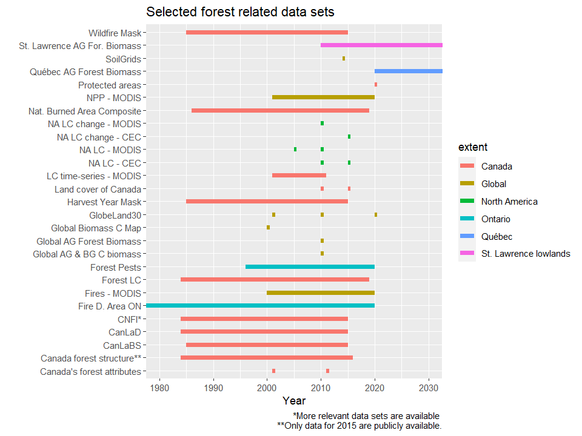

# carbon-seq-resources
Carbon sequestration resources
## Carbon sequestration data
Here is a list of potentially useful data sources for analyzing forest (and wetland) carbon.

|author|short_name|date_start|date_end|format|extent| url_data|url_paper|
|-----|-----|-----|-----|-----|-----|-----|-----|
|Santoro et al. 2021|Global Biomass|2010|2010|raster|Global|[data link](https://globbiomass.org/wp-content/uploads/GB_Maps/Globbiomass_global_dataset.html)|[paper link](https://doi.org/10.5194/essd-13-3927-2021)|
|Gibbs & Ruesch 2008|Global Biomass|2000|2000|raster|Global|[data link](https://data.ess-dive.lbl.gov/view/doi:10.15485/1463800)||
|Laroque|St. Lawrence AGB|2010|2150|raster|St. Lawrence lowlands|||
|Boulanger & Pascual Puigdevall 2021|Quebec AGB|2020|2150|raster|Quebéc||[paper link](https://doi.org/10.1007/s10980-021-01241-7)|
|Guindon et al. 2020|CanLaBS|1985|2015|raster|Canada|[data link](https://open.canada.ca/data/en/dataset/b1f61b7e-4ba6-4244-bc79-c1174f2f92cd)|[paper link](https://cdnsciencepub.com/doi/10.1139/cjfr-2020-0353)|
|CEC/MODIS|NA LC - MODIS 2005|2005|2005|raster|North America|[data link]( http://www.cec.org/files/atlas)||
|CEC/MODIS|NA LC - MODIS 2010|2010|2010|raster|North America|[data link]( http://www.cec.org/files/atlas)||
|CEC/MODIS|NA LC change - MODIS|2010|2010|raster|North America|[data link]( http://www.cec.org/files/atlas)||
|CEC|North America LC change - CEC|2015|2015|raster|North America|[data link]( http://www.cec.org/files/atlas)||
|Canadian Soil Information Service|NC Soils|||raster|Canada|[data link](https://sis.agr.gc.ca/cansis/interpretations/carbon/northerncircumpolar.zip)|[paper link](https://sis.agr.gc.ca/cansis/interpretations/carbon/index.html)|
|Canadian Soil Information Service|Peatlands|||raster|Canada|[data link](https://sis.agr.gc.ca/cansis/interpretations/carbon/peatlandofCanada.zip)|[paper link](https://sis.agr.gc.ca/cansis/interpretations/carbon/index.html)|
|Canadian Soil Information Service|Canada Soil db|||raster|Canada|[data link](https://sis.agr.gc.ca/cansis/interpretations/carbon/soilcarbonofCanada.zip)|[paper link](https://sis.agr.gc.ca/cansis/interpretations/carbon/index.html)|
|Government of China|GlobeLand30|2001|2001|raster|Global|[data link](http://www.globallandcover.com/Page/EN_sysFrame/dataIntroduce.html?columnID=81&head=references&para=references&type=data)|[paper link](https://www.nature.com/articles/514434c)|
|Government of China|GlobeLand30|2010|2010|raster|Global|[data link](http://www.globallandcover.com/Page/EN_sysFrame/dataIntroduce.html?columnID=81&head=references&para=references&type=data)|[paper link](https://www.nature.com/articles/514434c)|
|Government of China|GlobeLand30|2020|2020|raster|Global|[data link](http://www.globallandcover.com/Page/EN_sysFrame/dataIntroduce.html?columnID=81&head=references&para=references&type=data)||
|Agriculture and Agri-Food Canada|Pedon db|2016|2016|vector|Canada|[data link](https://open.canada.ca/data/en/dataset/6457fad6-b6f5-47a3-9bd1-ad14aea4b9e0)||
|Pouliot et al. 2014|Land cover time-series|2001|2011|raster|Canada||[paper link](https://doi.org/10.1016/j.rse.2013.10.004)|
|Lehner & Grill (2013) |HydroBASINS|2013|2013|vector|Global|[data link](https://www.hydrosheds.org/page/hydrobasins)|[paper link](https://doi.org/10.1002/hyp.9740)|
|Lehner & Grill (2013) |HydroRIVERS|2013|2013|vector|Global|[data link](https://www.hydrosheds.org/page/hydrorivers)|[paper link](https://doi.org/10.1002/hyp.9740)|
|Messager et al. (2016)|HydroLAKES|2016|2016|vector|Global|[data link](https://www.hydrosheds.org/page/hydrolakes)|[paper link](https://www.nature.com/articles/ncomms13603)|
|Linke et al. (2019)|HydroATLAS|2019|2019|vector|Global|[data link](https://figshare.com/articles/dataset/HydroATLAS_version_1_0/9890531)|[paper link](https://www.nature.com/articles/s41597-019-0300-6)|
|Hermosilla et al. (2016)|Wildfire Mask|1985|2015|raster|Canada|[data link](https://www.tandfonline.com/doi/full/10.1080/17538947.2016.1187673)||
|Government of Canada|Protected areas|2020|2020|vector|Canada|[data link](https://www.canada.ca/en/environment-climate-change/services/national-wildlife-areas/protected-conserved-areas-database.html)||
|Natural Resources Canada |Land cover of Canada|2010|2010|raster|Canada|[data link](https://open.canada.ca/data/en/dataset/c688b87f-e85f-4842-b0e1-a8f79ebf1133)||
|Natural Resources Canada |Land cover of Canada|2015|2015|raster|Canada|[data link](https://open.canada.ca/data/en/dataset/4e615eae-b90c-420b-adee-2ca35896caf6)||
|Agriculture and Agri-Food Canada |Annual Crop Inventory|2009|2019|raster|Canada|[data link](https://www.agr.gc.ca/atlas/data_donnees/agr/annualCropInventory/tif/2019/)||
|Mastasci et al. (2017)|Canada forest structure|2006|2012|raster|Canada||[paper link](https://www.sciencedirect.com/science/article/pii/S0034425718303572)|
|NASA - NEO|Fires - MODIS|2000|2020|raster|Global|[data link](https://earthobservatory.nasa.gov/global-maps/MOD14A1_M_FIRE)||
|National Forest Inventory System|CNFI|||vector|Canada|||
|Hall et al. (2020)|Nat. Burned Area Composite|1986|2019|raster|Canada||[paper link](https://www.publish.csiro.au/wf/WF19201)|
|Geological Survey of Canada|Peatlands|2011|2011.5|vector|Canada|[data link](https://geoscan.nrcan.gc.ca/starweb/geoscan/servlet.starweb?path=geoscan/fulle.web&search1=R=288786)||
|NASA - NEO|NPP - MODIS|2001|2020|raster|Global|[data link](https://lpdaac.usgs.gov/products/mod17a3hv006/)||
|Hengl et al. (2017)|SoilGrids|2014|2014.5|raster|Global|[data link](https://journals.plos.org/plosone/article?id=10.1371/journal.pone.0169748)|[paper link](https://soilgrids.org/)|
|National Forest Inventory System|CNFI*|1984|2015|raster|Canada|[data link](https://opendata.nfis.org/mapserver/nfis-change_eng.html)||
|Hermosilla et al. (2016)|Harvest Year Mask|1985|2015|raster|Canada|[data link](https://opendata.nfis.org/mapserver/nfis-change_eng.html)|[paper link](https://www.tandfonline.com/doi/full/10.1080/17538947.2016.1187673)|
|Open Canada|National Hydro Network|2016|2016|vector|Canada|[data link](https://open.canada.ca/data/en/dataset/a4b190fe-e090-4e6d-881e-b87956c07977)||
|Beaudoin et al. 2017|Canada's forest attributes|2001|2001|raster|Canada|[data link](https://ftp.maps.canada.ca/pub/nrcan_rncan/Forests_Foret/canada-forests-attributes_attributs-forests-canada/)|[paper link](https://cdnsciencepub.com/doi/10.1139/cjfr-2017-0184)|
|Beaudoin et al. 2017|Canada's forest attributes|2011|2011|raster|Canada|[data link](https://open.canada.ca/data/en/dataset/ec9e2659-1c29-4ddb-87a2-6aced147a990)|[paper link](https://cdnsciencepub.com/doi/10.1139/cjfr-2017-0184)|
|Environment and Climate Change Canada|Canadian Wetland Inventory|2007|2007|vector|Quebéc|[data link](https://open.canada.ca/data/en/dataset/2381fe32-653c-431b-b520-a85b2396e377)||
|Environment and Climate Change Canada|Canadian Wetland Inventory|2007|2007|vector|Quebéc|[data link](https://open.canada.ca/data/en/dataset/09f46d71-6feb-4f8f-8eb5-a58a58b06af5)||
|CEC|North America LC - CEC|2015|2015|raster|North America|[data link]( http://www.cec.org/files/atlas)||
|CEC|North America LC - CEC|2010|2010|raster|North America|[data link]( http://www.cec.org/files/atlas)||
|Le Quéré et al. 2018|Global Carbon Budget|2006|2017|tabular|Global||[paper link](https://www.icos-cp.eu/science-and-impact/global-carbon-budget/2017)|
|Spawn et al. 2020|Global Carbon biomass|2010|2010|raster|Global|[data link](https://daac.ornl.gov/cgi-bin/dsviewer.pl?ds_id=1763)|[paper link](https://www.nature.com/articles/s41597-020-0444-4)|
|StatsCan|Census SD|2016|2016|vector|Canada|[data link](https://www12.statcan.gc.ca/census-recensement/2011/geo/bound-limit/bound-limit-2016-eng.cfm)||
|Agriculture and Agri-Food Canada |Ecodistricts|1991|1999|vector|Canada|[data link](https://open.canada.ca/data/en/dataset/fe9fd41c-1f67-4bc5-809d-05b62986b26b)||
|Agriculture and Agri-Food Canada |Ecoprovinces|1991|1999|vector|Canada|[data link](https://open.canada.ca/data/en/dataset/98fa7335-fbfe-4289-9a0e-d6bf3874b424)||
|Agriculture and Agri-Food Canada |Ecoregions|1991|1999|vector|Canada|[data link](https://open.canada.ca/data/en/dataset/ade80d26-61f5-439e-8966-73b352811fe6)||
|Government of Ontario|Ecozones|2020|2020||Ontario|[data link](https://open.canada.ca/data/en/dataset/092130fc-7eed-480e-9dee-f0c564ba11df)||
|Agriculture and Agri-Food Canada|Ecozones|2013|2013|vector|Canada|[data link](https://open.canada.ca/data/en/dataset/7ad7ea01-eb23-4824-bccc-66adb7c5bdf8)||
|Dallaire et al. 2018|GloRiC|2018|2018|vector|Global|[data link](https://www.hydrosheds.org/page/gloric)|[paper link](https://iopscience.iop.org/article/10.1088/1748-9326/aad8e9)|
|Wang et al. (2016)|ClimateNA|1980|2021|raster|North America|[data link](https://sites.ualberta.ca/~ahamann/data/climatena.html)|[paper link](https://journals.plos.org/plosone/article?id=10.1371/journal.pone.0156720)|
|FLUXNET Canada|FLUXNET Canada|1993|2014|vector|Canada|[data link](https://daac.ornl.gov/cgi-bin/dsviewer.pl?ds_id=1335)|[paper link](https://daac.ornl.gov/FLUXNET/guides/FLUXNET_Canada.html)|
|StatsCan|Agricultural Regions|2016|2016|vector|Canada|[data link](https://www12.statcan.gc.ca/census-recensement/2011/geo/bound-limit/bound-limit-2016-eng.cfm)||
|StatsCan|Economic Regions|2016|2016|vector|Canada|[data link](https://www12.statcan.gc.ca/census-recensement/2011/geo/bound-limit/bound-limit-2016-eng.cfm)||
|StatsCan|Province/Territory|2016|2016|vector|Canada|[data link](https://www12.statcan.gc.ca/census-recensement/2011/geo/bound-limit/bound-limit-2016-eng.cfm)||
|WWF|GLWD (lakes and wetlands)|2004|2004|vector|Global|[data link](https://www.worldwildlife.org/publications/global-lakes-and-wetlands-database-large-lake-polygons-level-1)||
|WWF|GLWD (lakes and wetlands)|2004|2004|vector|Global|[data link](https://www.worldwildlife.org/publications/global-lakes-and-wetlands-database-small-lake-polygons-level-2)||
|WWF|GLWD (lakes and wetlands)|2004|2004|vector|Global|[data link](https://www.worldwildlife.org/publications/global-lakes-and-wetlands-database-lakes-and-wetlands-grid-level-3)||

A time-line figure using some of the above entries. R code for this figure is found in the `R_code` folder.

